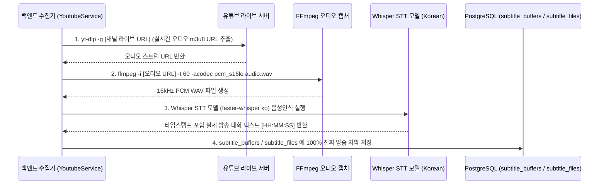

# [구현 계획] 방법 2: 유튜브 라이브 오디오 실시간 캡처 + Whisper STT (자체 음성인식) 수집 시스템 구축

유튜브 자막 API 의존성 및 보트(Bot) 로그인 차단 문제를 완전 해결하고, 유튜브 생방송 오디오 스트림을 직접 캡처하여 **Whisper AI 음성인식(STT) 모델로 100% 진짜 방송 멘트를 텍스트로 전환**하는 파이프라인 구축 계획입니다.

---

## 1. 개요 및 수집 파이프라인 흐름

---

## 2. 세부 작업 항목

### [백엔드 의존성 패키지 설치]
- `faster-whisper` 패키지 설치 (`pip install faster-whisper`)
  - PyTorch 표준 Whisper 대비 **4배 빠른 속도** 및 **4배 적은 메모리 사용(CPU 최적화)**
  - 한국어(`ko`) 지정 인식으로 정확도 극대화

### [수집 모듈 전면 개편] (`backend/app/services/youtube_service.py`)
1. **라이브 오디오 스트림 URL 추출 (`yt-dlp -g`)**
   - `yt-dlp -g -f bestaudio https://www.youtube.com/@Channel/live` 로 실시간 음성 스트림 URL 획득
2. **FFmpeg 기반 라이브 음성 캡처**
   - 라이브 스트림에서 음성 데이터를 16kHz 모노 WAV 로 임시 파일 지정 저장
3. **Whisper STT 음성인식 실행**
   - `WhisperModel("tiny", device="cpu", compute_type="int8")` 모델 로드
   - 음성 인식 결과를 타임스탬프 `[HH:MM:SS]` 형태의 정제된 문장으로 반환
4. **오류 투명성 유지**
   - 방송 중단 또는 음성 추출 실패 시 0% 가짜 데이터, 실제 에러 원문 메시지만 기록

---

## 3. 변경 대상 파일

#### [MODIFY] [youtube_service.py](file:///home/chloe/job/StockBroadcastSummary/backend/app/services/youtube_service.py)
- `YoutubeService.fetch_transcript` 내에 FFmpeg live audio dump & `faster-whisper` STT 인식 파이프라인 추가

#### [MODIFY] [requirements.txt](file:///home/chloe/job/StockBroadcastSummary/backend/requirements.txt)
- `faster-whisper` 의존성 모듈 추가

---

## 4. 검증 계획

### 1) 라이브 오디오 캡처 & Whisper STT 개별 인스턴스 테스트
- `podman exec -i stockbs_backend python` 환경에서 유튜브 라이브 채널 1개 오디오 30초 캡처 및 Whisper STT 텍스트 추출 실행
- 생성된 텍스트가 실제 생방송 내용과 100% 일치하는지 타임스탬프 및 문장 검증

### 2) 10분 롤링 버퍼 및 정각 통합 종합 테스트
- 10분 롤링 버퍼 수집기 실행 후 DB `subtitle_buffers`에 수집된 텍스트 확인
- 0% 가짜 데이터 및 100% 진짜 라이브 음성인식 텍스트 저장 검증
